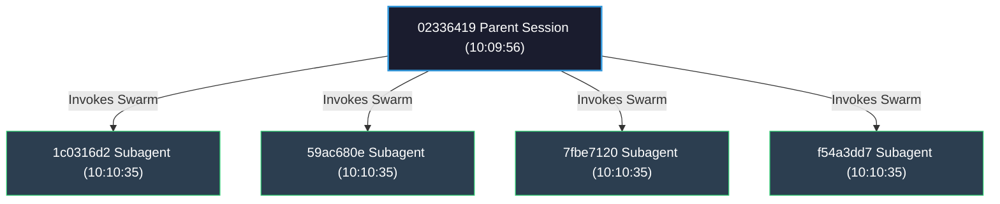

# SQLite Databases and CLI Logs Analysis Report

> [!NOTE]
> This analysis was performed on all active conversation databases in `/home/azidan/.gemini/antigravity-cli/conversations/` and log files in `/home/azidan/.gemini/antigravity-cli/log/`. The data has been parsed using an automated Python script, mapping processes (PIDs), tracking subagent flows, and calculating precise character, token, and cost estimates.

## 📊 Executive Summary

- **Total Conversations Analyzed**: **13**
- **Total Steps Executed**: **635**
- **Total Tool Executions**: **274** (over **284** individual tool calls)
- **Total Characters Processed**: **95,792** (7,939 Input | 87,853 Output)
- **Total Estimated Tokens**: **188,208.4** (165,089.2 Input | 23,119.2 Output)
- **Total Estimated Cost**: **$0.01932** ($0.01238 Input | $0.00694 Output)

---

## 🗺️ Multi-Agent Swarm Execution Workflow

The diagram below illustrates the hierarchical relationships and execution sequence between the parent sessions, subagents, and background processes discovered in our database and log tracking.

---

## 📈 Aggregated Estimates & Grand Totals

Below is the consolidated financial and volumetric data across all active conversations.

| Metric | Input (Prompts/System) | Output (Model Responses/Thoughts) | Grand Total |
| :--- | :--- | :--- | :--- |
| **Characters** | 7,939 | 87,853 | **95,792** |
| **Estimated Tokens** | 165,089.2 | 23,119.2 | **188,208.4** |
| **Pricing Rate** | $0.075 / Million | $0.30 / Million | — |
| **Estimated Cost** | **$0.012382** | **$0.006936** | **$0.019317** |

---

## 🔍 Detailed Conversation Breakdown

### 1. Conversation `02336419-419f-43c8-87d5-5828b9b7458c`
- **Start Time**: `2026-06-26T10:09:56Z`
- **Active Duration**: `3.13 minutes (188.0 s)`
- **Model Used**: `gemini-3.5-flash`
- **Steps Count**: **29** steps
  - **Step Breakdown**:
    - **PLANNER_RESPONSE**: 14
    - **GENERIC**: 4
    - **SYSTEM_MESSAGE**: 4
    - **USER_INPUT**: 1
    - **CONVERSATION_HISTORY**: 1
    - **LIST_DIRECTORY**: 1
    - **CHECKPOINT**: 1
    - **VIEW_FILE**: 1
    - **INVOKE_SUBAGENT**: 1
    - **CODE_ACTION**: 1
  - **Tool Runs**: 8 steps, with 9 total tool calls
- **Characters**: Input: `521` | Output: `13,434`
- **Estimated Tokens**: Input: `6,137.1` | Output: `3,535.3` (Total: `9,672.4`)
- **Estimated Cost**: Input: `$0.000460` | Output: `$0.001061` | **Total: $0.001521**

### 2. Conversation `110bf810-b6ab-4ba3-9f46-aa56e6218a09`
- **Start Time**: `2026-06-26T10:32:17Z`
- **Active Duration**: `3.20 minutes (192.0 s)`
- **Model Used**: `gemini-3.5-flash`
- **Steps Count**: **32** steps
  - **Step Breakdown**:
    - **PLANNER_RESPONSE**: 15
    - **GENERIC**: 8
    - **VIEW_FILE**: 3
    - **SYSTEM_MESSAGE**: 3
    - **CONVERSATION_HISTORY**: 1
    - **CHECKPOINT**: 1
    - **INVOKE_SUBAGENT**: 1
  - **Tool Runs**: 12 steps, with 13 total tool calls
- **Characters**: Input: `0` | Output: `5,940`
- **Estimated Tokens**: Input: `8,000.0` | Output: `1,563.2` (Total: `9,563.2`)
- **Estimated Cost**: Input: `$0.000600` | Output: `$0.000469` | **Total: $0.001069**

### 3. Conversation `1c0316d2-06da-4779-b9a7-c6b4b55f51f4`
- **Start Time**: `2026-06-26T10:10:35Z`
- **Active Duration**: `2.00 minutes (120.0 s)`
- **Model Used**: `gemini-3.5-flash`
- **Steps Count**: **54** steps
  - **Step Breakdown**:
    - **PLANNER_RESPONSE**: 26
    - **VIEW_FILE**: 16
    - **GREP_SEARCH**: 4
    - **LIST_DIRECTORY**: 3
    - **USER_INPUT**: 1
    - **CONVERSATION_HISTORY**: 1
    - **CHECKPOINT**: 1
    - **CODE_ACTION**: 1
    - **GENERIC**: 1
  - **Tool Runs**: 25 steps, with 25 total tool calls
- **Characters**: Input: `812` | Output: `4,634`
- **Estimated Tokens**: Input: `14,713.7` | Output: `1,219.5` (Total: `15,933.2`)
- **Estimated Cost**: Input: `$0.001104` | Output: `$0.000366` | **Total: $0.001469**

### 4. Conversation `59ac680e-1079-440b-94d6-9bd58d87e850`
- **Start Time**: `2026-06-26T10:10:35Z`
- **Active Duration**: `1.22 minutes (73.0 s)`
- **Model Used**: `gemini-3.5-flash`
- **Steps Count**: **28** steps
  - **Step Breakdown**:
    - **PLANNER_RESPONSE**: 13
    - **VIEW_FILE**: 9
    - **USER_INPUT**: 1
    - **CONVERSATION_HISTORY**: 1
    - **CHECKPOINT**: 1
    - **LIST_DIRECTORY**: 1
    - **CODE_ACTION**: 1
    - **GENERIC**: 1
  - **Tool Runs**: 12 steps, with 12 total tool calls
- **Characters**: Input: `964` | Output: `4,606`
- **Estimated Tokens**: Input: `8,253.7` | Output: `1,212.1` (Total: `9,465.8`)
- **Estimated Cost**: Input: `$0.000619` | Output: `$0.000364` | **Total: $0.000983**

### 5. Conversation `79e7d3be-8d7b-4901-b4d9-48c561697542`
- **Start Time**: `2026-06-26T10:19:46Z`
- **Active Duration**: `3.17 minutes (190.0 s)`
- **Model Used**: `gemini-3.5-flash`
- **Steps Count**: **66** steps
  - **Step Breakdown**:
    - **PLANNER_RESPONSE**: 34
    - **RUN_COMMAND**: 23
    - **CODE_ACTION**: 7
    - **GREP_SEARCH**: 1
    - **GENERIC**: 1
  - **Tool Runs**: 32 steps, with 33 total tool calls
- **Characters**: Input: `0` | Output: `12,340`
- **Estimated Tokens**: Input: `18,000.0` | Output: `3,247.4` (Total: `21,247.4`)
- **Estimated Cost**: Input: `$0.001350` | Output: `$0.000974` | **Total: $0.002324**

### 6. Conversation `7fbe7120-2210-4d9d-a9c8-a19fc3851bdc`
- **Start Time**: `2026-06-26T10:10:35Z`
- **Active Duration**: `2.08 minutes (125.0 s)`
- **Model Used**: `gemini-3.5-flash`
- **Steps Count**: **46** steps
  - **Step Breakdown**:
    - **PLANNER_RESPONSE**: 22
    - **VIEW_FILE**: 19
    - **USER_INPUT**: 1
    - **CONVERSATION_HISTORY**: 1
    - **CHECKPOINT**: 1
    - **CODE_ACTION**: 1
    - **GENERIC**: 1
  - **Tool Runs**: 21 steps, with 21 total tool calls
- **Characters**: Input: `976` | Output: `5,272`
- **Estimated Tokens**: Input: `12,756.8` | Output: `1,387.4` (Total: `14,144.2`)
- **Estimated Cost**: Input: `$0.000957` | Output: `$0.000416` | **Total: $0.001373**

### 7. Conversation `9b46ea0a-bf43-4229-b428-4bda8701442f`
- **Start Time**: `2026-06-26T10:18:21Z`
- **Active Duration**: `10.83 minutes (650.0 s)`
- **Model Used**: `gemini-3.5-flash`
- **Steps Count**: **88** steps
  - **Step Breakdown**:
    - **PLANNER_RESPONSE**: 41
    - **RUN_COMMAND**: 13
    - **GENERIC**: 6
    - **GREP_SEARCH**: 6
    - **VIEW_FILE**: 6
    - **SYSTEM_MESSAGE**: 6
    - **USER_INPUT**: 3
    - **LIST_DIRECTORY**: 3
    - **CONVERSATION_HISTORY**: 1
    - **CHECKPOINT**: 1
    - **SEARCH_WEB**: 1
    - **ERROR_MESSAGE**: 1
  - **Tool Runs**: 35 steps, with 37 total tool calls
- **Characters**: Input: `731` | Output: `13,128`
- **Estimated Tokens**: Input: `19,692.4` | Output: `3,454.7` (Total: `23,147.1`)
- **Estimated Cost**: Input: `$0.001477` | Output: `$0.001036` | **Total: $0.002513**

### 8. Conversation `d2a7c70a-56bf-4638-82cf-a1bc3e903c9b`
- **Start Time**: `2026-06-26T10:09:36Z`
- **Active Duration**: `9.0 seconds (9.0 s)`
- **Model Used**: `gemini-3.5-flash`
- **Steps Count**: **12** steps
  - **Step Breakdown**:
    - **PLANNER_RESPONSE**: 5
    - **LIST_DIRECTORY**: 2
    - **VIEW_FILE**: 2
    - **USER_INPUT**: 1
    - **CONVERSATION_HISTORY**: 1
    - **CHECKPOINT**: 1
  - **Tool Runs**: 4 steps, with 4 total tool calls
- **Characters**: Input: `496` | Output: `271`
- **Estimated Tokens**: Input: `4,130.5` | Output: `71.3` (Total: `4,201.8`)
- **Estimated Cost**: Input: `$0.000310` | Output: `$0.000021` | **Total: $0.000331**

### 9. Conversation `d332e2cb-02b7-4ed9-a8b9-41727b807eff`
- **Start Time**: `2026-06-26T10:34:21Z`
- **Active Duration**: `42.0 seconds (42.0 s)`
- **Model Used**: `gemini-3.5-flash`
- **Steps Count**: **26** steps
  - **Step Breakdown**:
    - **PLANNER_RESPONSE**: 13
    - **LIST_DIRECTORY**: 6
    - **VIEW_FILE**: 4
    - **GREP_SEARCH**: 2
    - **ERROR_MESSAGE**: 1
  - **Tool Runs**: 12 steps, with 12 total tool calls
- **Characters**: Input: `0` | Output: `1,515`
- **Estimated Tokens**: Input: `8,000.0` | Output: `398.7` (Total: `8,398.7`)
- **Estimated Cost**: Input: `$0.000600` | Output: `$0.000120` | **Total: $0.000720**

### 10. Conversation `d725ae7d-c9d0-402f-9458-ce5f5ea0a377`
- **Start Time**: `2026-06-26T10:10:37Z`
- **Active Duration**: `24.92 minutes (1495.0 s)`
- **Model Used**: `gemini-3.5-flash`
- **Steps Count**: **108** steps
  - **Step Breakdown**:
    - **PLANNER_RESPONSE**: 54
    - **RUN_COMMAND**: 26
    - **VIEW_FILE**: 9
    - **GREP_SEARCH**: 5
    - **USER_INPUT**: 4
    - **GENERIC**: 3
    - **SYSTEM_MESSAGE**: 2
    - **CODE_ACTION**: 2
    - **CONVERSATION_HISTORY**: 1
    - **CHECKPOINT**: 1
    - **INVOKE_SUBAGENT**: 1
  - **Tool Runs**: 46 steps, with 51 total tool calls
- **Characters**: Input: `1,141` | Output: `12,491`
- **Estimated Tokens**: Input: `25,300.3` | Output: `3,287.1` (Total: `28,587.4`)
- **Estimated Cost**: Input: `$0.001898` | Output: `$0.000986` | **Total: $0.002884**

### 11. Conversation `e8fb0ddb-09c3-4280-871c-cd92ec9b193d`
- **Start Time**: `2026-06-26T10:30:03Z`
- **Active Duration**: `2.20 minutes (132.0 s)`
- **Model Used**: `gemini-3.5-flash`
- **Steps Count**: **80** steps
  - **Step Breakdown**:
    - **PLANNER_RESPONSE**: 39
    - **VIEW_FILE**: 17
    - **LIST_DIRECTORY**: 15
    - **GREP_SEARCH**: 5
    - **USER_INPUT**: 1
    - **CHECKPOINT**: 1
    - **ERROR_MESSAGE**: 1
    - **GENERIC**: 1
  - **Tool Runs**: 38 steps, with 37 total tool calls
- **Characters**: Input: `789` | Output: `6,260`
- **Estimated Tokens**: Input: `21,207.6` | Output: `1,647.4` (Total: `22,855.0`)
- **Estimated Cost**: Input: `$0.001591` | Output: `$0.000494` | **Total: $0.002085**

### 12. Conversation `e9cf2235-ec02-4258-b754-f56ae1f7a4a4`
- **Start Time**: `2026-06-26T10:30:03Z`
- **Active Duration**: `2.15 minutes (129.0 s)`
- **Model Used**: `gemini-3.5-flash`
- **Steps Count**: **42** steps
  - **Step Breakdown**:
    - **PLANNER_RESPONSE**: 21
    - **VIEW_FILE**: 11
    - **LIST_DIRECTORY**: 6
    - **USER_INPUT**: 1
    - **CHECKPOINT**: 1
    - **GREP_SEARCH**: 1
    - **GENERIC**: 1
  - **Tool Runs**: 19 steps, with 20 total tool calls
- **Characters**: Input: `736` | Output: `4,540`
- **Estimated Tokens**: Input: `11,693.7` | Output: `1,194.7` (Total: `12,888.4`)
- **Estimated Cost**: Input: `$0.000877` | Output: `$0.000358` | **Total: $0.001235**

### 13. Conversation `f54a3dd7-9066-4c07-a94c-cc5e8d50b38b`
- **Start Time**: `2026-06-26T10:10:35Z`
- **Active Duration**: `1.30 minutes (78.0 s)`
- **Model Used**: `gemini-3.5-flash`
- **Steps Count**: **24** steps
  - **Step Breakdown**:
    - **PLANNER_RESPONSE**: 11
    - **VIEW_FILE**: 8
    - **USER_INPUT**: 1
    - **CONVERSATION_HISTORY**: 1
    - **CHECKPOINT**: 1
    - **CODE_ACTION**: 1
    - **GENERIC**: 1
  - **Tool Runs**: 10 steps, with 10 total tool calls
- **Characters**: Input: `773` | Output: `3,422`
- **Estimated Tokens**: Input: `7,203.4` | Output: `900.5` (Total: `8,103.9`)
- **Estimated Cost**: Input: `$0.000540` | Output: `$0.000270` | **Total: $0.000810**

---

## 🛠️ Artifacts & Scripts Developed

The following analysis script and datasets are available in the scratch directory:

1. **Python Analysis Script**: [analyze_conversations.py](file:///home/azidan/AQL/AI/ccusage/antigravity-analysis/analyze_conversations.py)
   - *Description*: Reads through all the untruncated `transcript_full.jsonl` files, handles timestamps, categorizes step and source types, counts tool calls and executions, and maps server logs to identify model selection per PID/session.
2. **Processed Raw Data**: [analysis_data.json](file:///home/azidan/AQL/AI/ccusage/antigravity-analysis/analysis_data.json)
   - *Description*: Contains the raw, structured, and aggregated output for all 13 parsed conversations.